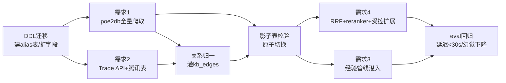

# PoE2LI 当前需求解决思路（详细版）

> 对应需求文档：`docs/当前需求汇总.md`（commit 3745e13）
> 本文档目标：把四大需求（实体关系全量重建 / 中英映射 / 玩家经验注入 / 检索精度提升）的解决思路一次性写清楚，包含数据流、Schema、爬取策略、灌入管线、迁移脚本、评测验收和实施路线图，可直接据此排期落地。

---

## 0. 全局判断：这四个需求的本质是什么

把四个需求抽象一下，本质上是同一个底层问题的四个切面：

| 需求 | 本质问题 | 一句话方向 |
|------|----------|------------|
| 需求1 实体关系全量重建 | 知识图谱**召回不全 + 关系缺失** | 让数据源结构驱动覆盖，而非人脑/NLP 枚举 |
| 需求2 中英映射 | **同一实体的多语言别名归一** | 分层映射 + 别名表，多入口指向同一 canonical id |
| 需求3 玩家经验注入 | 知识库只有"事实"缺"经验"，**schema 太死** | 自由标签 + 可信度加权 + 主观关系边 |
| 需求4 检索精度 | **召回→排序→扩展** 链路不够精 | RRF 分层融合 + reranker + 受控图扩展 |

四者有一条共享主线：**统一的实体 ID 体系（canonical entity id）**。
- 需求1 产出 canonical 实体和官方关系边；
- 需求2 给每个 canonical 实体挂多语言别名；
- 需求3 把经验片段挂到 canonical 实体上（而不是游离的文本）；
- 需求4 检索时先把 query 命中到 canonical 实体，再沿关系边受控扩展。

所以**实施顺序不能乱**：必须先做需求1（建立 canonical id 体系）→ 需求2（别名挂载，与1可并行爬取）→ 需求4（检索改造）→ 需求3（经验注入，schema 先行但灌库可滞后）。

下文先给总体架构，再逐需求展开。

---

## 1. 总体架构

### 1.1 数据分层

```
                  ┌──────────────────────────────────────────┐
                  │                查询层 (Agent)               │
                  │  intent 识别 → 实体命中 → 检索 → 受控扩展    │
                  └───────────────┬──────────────────────────┘
                                  │
        ┌─────────────────────────┼─────────────────────────┐
        │                         │                         │
┌───────▼────────┐      ┌─────────▼─────────┐      ┌────────▼────────┐
│  kb_entities   │      │  knowledge_chunks │      │    kb_edges     │
│  (canonical    │◄────►│  (向量检索语料)    │◄────►│  (关系图谱)      │
│   实体 + 别名)  │      │  官方事实 + 经验   │      │  官方边 + 经验边  │
└───────▲────────┘      └─────────▲─────────┘      └────────▲────────┘
        │                         │                         │
┌───────┴─────────────────────────┴─────────────────────────┴────────┐
│                         灌入管线 (ETL)                                │
│  ① poe2db 结构化爬取   ② Trade API 对照   ③ 腾讯差异表   ④ 经验提取    │
└─────────────────────────────────────────────────────────────────────┘
```

### 1.2 核心数据契约（贯穿四需求）

定义一个稳定的 **canonical entity id** 规则，所有数据源最终都归一到它：

```
entity_id = f"{entity_type}:{name_en_slug}"
# 例：ascendancy:witchhunter, class:huntress, skill:lightning_arrow
```

- `name_en` 作为唯一锚点（英文名最稳定，赛季间几乎不变）。
- 中文名（国服/poe2db）、腾讯服译名都作为 **别名（alias）** 挂到同一个 entity_id 上。
- 这样需求2 的多语言、需求3 的经验、需求4 的扩展，全部围绕同一个 id 转，永不分裂。

---

## 2. 需求1：实体 + 关系全量重建（P1）

### 2.1 核心思路（针对根因）

需求文档已经点出根因：**实体来自 NLP 词典从 chunk 提取 → 词典不全 → 大量漏掉**。
解决方向文档也说清楚了：**不要枚举关系类型，让 poe2db.tw 的页面结构驱动覆盖范围**。

我把这个思路再具体化为一句可执行的原则：

> **每个 poe2db 页面 = 一个实体节点；页面里每个指向其他页面的"字段链接" = 一条关系边。**

这样我们不需要预先知道"有哪些关系类型"，只要忠实地把页面结构里的链接关系搬进 kb_edges，relation 类型就由字段名自然决定。

### 2.2 爬取架构（三阶段）

poe2db.tw 是结构化数据站，URL 有明显的类型前缀（如 `/cn/Skill`、`/cn/Ascendancy`、`/cn/Unique` 等），适合做"分类全量"爬取而非盲目广度爬。

**阶段 A — 实体清单发现（Discovery）**
- 从 poe2db 各类型的**索引/列表页**入手，拿到该类型下所有实体的 URL 全集。
- 实体类型清单（覆盖游戏全模块）：
  - `class`（职业）、`ascendancy`（升华）
  - `skill`（主动技能宝石）、`support`（辅助宝石）、`spirit_gem`（持续宝石）
  - `base_item`（基底装备）、`unique`（暗金）、`mod`（词缀）
  - `passive`（天赋节点）、`keystone`（核心天赋）
  - `currency`（通货）、`flask`（药剂）
  - `monster` / `boss`（怪物/首领）、`map`（地图/区域）
  - `tag`（标签：攻击/法术/范围/投射物…）
- 产出：`entity_urls.jsonl`，每行 `{entity_type, url, name_cn?, name_en?}`。
- 这一步替代了旧的 NLP 词典——**清单从索引页来，源头有什么就有什么**，根治"女猎手/行者/猎巫人缺失"。

**阶段 B — 实体详情解析（Detail Parse）**
- 对每个 URL，解析页面，抽出两类信息：
  1. **实体自身字段** → 写 `kb_entities`：`name_cn / name_en / entity_type / attributes(json)`（如技能的 tags、所需武器；暗金的基底；升华的描述等）。
  2. **页面内指向其他实体的链接** → 暂存为**原始边**：`{src_url, dst_url, field_name}`。
     - `field_name` 来自页面区块标题/字段名，例如技能页的「Supported By」「Weapon」，暗金页的「Base Item」，升华页的「Class」。
- 这一步**不做关系语义判断**，只忠实记录"谁链接到谁、在哪个字段下"。

**阶段 C — 关系归一（Edge Normalization）**
- 把阶段 B 的原始边里的 `src_url/dst_url` 通过 URL→entity_id 映射表解析成 canonical id。
- 把 `field_name` 映射到标准 `relation` 枚举（一张**可维护的字段→关系映射表**，不是写死在代码里的 if-else）：

```yaml
# field_relation_map.yaml （可随发现新字段增量补充）
"Supported By":      supports        # 辅助宝石 → 技能
"Weapon":            requires_weapon # 技能 → 所需武器类型
"Base Item":         based_on        # 暗金 → 基底
"Class":             belongs_to      # 升华 → 职业
"Implicit":          has_implicit    # 装备 → 自带词缀
"Tags":              has_tag         # 宝石 → 标签
"Drops From":        drops_from      # 物品 → 掉落来源
"Grants":            grants          # 天赋 → 属性加成
# 未命中映射的 field 落到 related_to（保底，不丢数据），并记日志待人工归类
```

> 关键设计：**未识别的字段一律落 `related_to` 保底边并打日志**，绝不丢弃。这样既不漏关系，又能通过日志增量发现新关系类型，慢慢把它们从 `related_to` 升级成精确 relation。这正好回应了评审要点"还有哪些关系类型当前忽略"。

### 2.3 工程实现要点

- **爬虫**：异步并发（aiohttp + 限速），带本地缓存（爬过的 URL 存 html，重跑只解析不重爬），礼貌爬取（随机延时 + UA + 失败重试 + 断点续爬）。
- **解析**：每个 entity_type 一个 parser（selectorlib / BeautifulSoup + CSS 选择器），解析规则集中在配置而非散落代码，poe2db 改版时只改选择器配置。
- **幂等灌入**：以 `entity_id` 为主键 upsert，`kb_edges` 以 `(src, relation, dst)` 唯一约束去重。重跑安全。
- **全量刷新策略**：新赛季用"影子表 + 原子切换"——爬到新表 `kb_entities_new`，校验通过后 `RENAME` 切换，避免半成品状态影响线上。

### 2.4 直接修复的已知 bug

- **猎巫人推荐给女猎手** → 有了 `belongs_to`（猎巫人 belongs_to 佣兵）边后，Agent 推荐升华时先沿 `class --belongs_to--> ascendancy` 反向查，约束住合法集合，杜绝跨职业误推。
- **核心职业/升华缺失** → 阶段 A 索引页全量发现，不再漏。

---

## 3. 需求2：中英文 + 腾讯服 / 国服映射（P1）

### 3.1 三层映射，统一收口到别名表

需求文档的分层方案是对的，我把它落成**一张 alias 表 + 一条优先级查询链**，而不是三张割裂的表各查各的。

新增 `kb_entity_aliases` 表（或 kb_entities 内嵌 aliases json，建议独立表便于索引）：

```sql
kb_entity_aliases(
  alias        TEXT,        -- 别名（任意语言/写法）
  entity_id    TEXT,        -- 指向 canonical 实体
  lang         TEXT,        -- en / zh-cn / zh-tw / tencent
  source       TEXT,        -- trade_api / poe2db / tencent_manual
  priority     INT,         -- 数据权威度，越小越优先
  UNIQUE(alias, lang)
)
```

三层数据**全部灌进这一张表**，区别只在 `source` 和 `priority`：

| 层 | 来源 | source | priority | 角色 |
|----|------|--------|----------|------|
| 第一层 | Trade API 官方对照（`trade_items_en_cn.json` ~2876 条） | `trade_api` | 0（最高） | 主力，赛季刷新 |
| 第二层 | poe2db 三语（爬取时提取 name_cn/name_tw） | `poe2db` | 1 | 补充百科类实体 |
| 第三层 | 腾讯服差异小表（手工几十条） | `tencent_manual` | 2 | 只补特例 |

### 3.2 查询链（按优先级归一）

中文 query 进来 → 查 `kb_entity_aliases`：
1. 命中多条时按 `priority` 升序取第一条 → 拿到 entity_id；
2. 第三层的腾讯差异只在"腾讯特例别名"上命中（如"畸变项链"），**不会反向污染主表**——因为它只是多挂一个 alias 指向同一 entity_id，主表实体本身不变。

> 关键设计回应文档要点：第一层为主力、第三层只补特例不反向污染。实现上靠 **alias 多对一指向 entity_id**，第三层只增加 alias 行，从不修改 entity 本身，天然无污染。

### 3.3 腾讯服差异表落地

- 用一个版本化的 `tencent_overrides.csv`（手工维护，进 git），字段 `tencent_name, canonical_en_or_id, note`。
- 评审要点问"现有多少已知差异/有无官方清单"：**先用现有已知差异（扭曲/畸变项链等）建表，后续靠"查询未命中日志"反哺**——每次国服玩家用了一个查不到的中文名，记日志，定期人工归类补进 overrides。这样表会自己长大，不需要一开始就有完整官方清单。

---

## 4. 需求3：玩家经验知识注入（P1）

### 4.1 设计原则：自由标签 + 可信度加权 + 主观关系边

需求文档要的是"承载非结构化经验、不预设固定类型"。落成三个动作：

**① knowledge_chunks 表扩展（从枚举 chunk_type → 自由标签）**

```sql
ALTER TABLE knowledge_chunks
  ADD COLUMN author        TEXT,     -- 来源玩家 / 来源 URL
  ADD COLUMN subjectivity  INT,      -- 0=硬数据 1=半主观 2=纯个人感受
  ADD COLUMN season        TEXT,     -- 赛季标记，如 "0.2.0"
  ADD COLUMN tags          TEXT;     -- 自由标签数组(json)，替代死枚举

-- chunk_type 保留向后兼容，但新数据主要靠 tags 自由标注
```

**② 新增实体类型**（挂到 kb_entities，复用同一 id 体系）
- `experience_snippet`（经验片段）、`player_opinion`（玩家观点）。
- 经验片段不是游离文本，**也要挂到它所讨论的 canonical 实体上**（通过关系边），这样检索某武器/某 BD 时能顺带召回相关经验。

**③ 新增主观关系边**（与官方边共存，权重不同）

```
better_than   (主观比较：武器A better_than 武器B)
works_with    (搭配经验：技能X works_with 辅助Y)
avoid_for     (避坑：词缀X avoid_for 职业Y)
seasonal_tip  (赛季特定经验)
```

- 在 kb_edges 增加 `weight` 和 `evidence_type`（official / experience）字段。
- 检索扩展时：official 边高权重必信；experience 边作为加权候选，且**永远标注来源和主观度**，Agent 回答时显式区分"官方数据"vs"玩家XX的经验（赛季0.2，个人观点）"。

### 4.2 经验灌入管线（多源格式归一）

支持需求要求的多种来源（Markdown 攻略 / 纯文本对话 / Q&A 对 / 截图标注）：

```
原始来源 → [格式适配器] → 统一中间格式 ExperienceItem → [实体链接] → [灌库]
```

- **格式适配器**：每种来源一个 loader（markdown_loader / chat_loader / qa_loader / image_caption_loader），都产出统一的 `ExperienceItem{text, author, season, subjectivity, mentioned_entities[]}`。
- **实体链接（关键）**：对经验文本做实体识别，把提到的武器/技能/BD 链接到 canonical entity_id —— 复用需求2 的 alias 表做实体归一（中文俗名也能命中）。这样经验自动挂到正确实体上。
- **可信度标注**：subjectivity 可由来源类型给默认值（攻略正文=1，物价数据=0，"我觉得"句式=2），也支持人工覆盖。

### 4.3 检索时如何用经验（与需求4联动）

- 官方事实命中后，沿 `mentioned/belongs_to` 找到实体，再查该实体的 experience 边 → 补充"经验视角"。
- 排序时官方权重 > 经验权重；同为经验时 subjectivity 越低（越硬）越优先。
- 回答模板强制分区：**【官方数据】… 【玩家经验·可信度标注】…**，避免经验幻觉冒充事实。

---

## 5. 需求4：检索精度提升（P0-B 未完部分）

目标：延迟 <30s，幻觉率进一步下降。三件套：RRF 分层融合 + BGE reranker + concept_links 受控扩展。

### 5.1 RRF 分层融合（按 intent 选策略）

```
query → intent 分类 (规则/小模型) ──┬─ 实体型 (问某武器/某升华) → 精确匹配优先
                                   ├─ 概念型 (问机制/怎么玩)   → 向量检索优先
                                   └─ 混合型                  → 两路并行
                          ↓
        ┌──────────────┴──────────────┐
   精确匹配召回(alias表/BM25)      向量检索召回(top-N)
        └──────────────┬──────────────┘
                  RRF 融合 (按 intent 给两路不同权重)
                       ↓ top-30 候选
```

- RRF 公式：`score(d)=Σ 1/(k + rank_i(d))`，k 取 60；按 intent 给精确路/向量路不同系数。
- 实体型 query 精确路权重高，能直接锁定 canonical 实体 → 大幅降低"扭曲/畸变项链混淆"这类百科幻觉。
- 详细策略沿用 `PoE2LI-解决思路3.0.md 附录 B.1`，本文档与其对齐，不重复推导。

### 5.2 BGE reranker（候选 top-30 → top-8）

- 融合后的 top-30 候选过 BGE reranker（cross-encoder），按 query-doc 相关性重排，取 top-8 进 LLM。
- 收益：召回阶段可以放宽（多召回保证不漏），精排阶段收紧（保证进 LLM 的都强相关），幻觉率下降。
- 延迟控制：reranker 只跑 30 条、batch 推理、可上 GPU/ONNX 量化；预算 < 2s。

### 5.3 concept_links 受控扩展（仅精确未命中时触发）

- 默认不做图扩展（图扩展是延迟和噪声的主要来源）。
- **仅当精确实体匹配未命中**（query 没锁定到任何 canonical 实体）时，才沿 kb_edges 做**1跳受控扩展**，且只走 official 高权重边、限制扩展节点数（如 ≤5）。
- 这样既补召回又不爆延迟，呼应 P0-A 已做的"工具调用硬截断"思想。

### 5.4 延迟预算（从 57s → <30s）

| 阶段 | 现状(估) | 目标 | 手段 |
|------|---------|------|------|
| intent+实体命中 | - | <0.5s | 规则/小模型/alias 索引 |
| 双路召回 | 慢 | <3s | rag_search 已 batch 并行(P0-A已做) |
| RRF 融合 | - | <0.2s | 纯计算 |
| reranker | 0 | <2s | top-30、batch、量化 |
| 受控扩展 | 多跳爆炸 | <1s | 仅未命中触发、1跳、限节点 |
| LLM 生成 | 大头 | <20s | top-8 精排后上下文更短 + 小模型分流简单 query |

---

## 6. 数据库 Schema 总览与迁移

### 6.1 表结构最终态

```sql
-- 实体表（需求1产出 canonical，需求3新增类型）
kb_entities(
  entity_id PK,        -- {type}:{en_slug}
  name_en, name_cn, name_tw,
  entity_type,         -- class/ascendancy/skill/support/base_item/unique/mod/
                       -- passive/currency/flask/monster/map/tag/
                       -- experience_snippet/player_opinion
  attributes JSON,     -- 类型特有字段
  league, game_version
)

-- 别名表（需求2，新增）
kb_entity_aliases(alias, entity_id FK, lang, source, priority, UNIQUE(alias,lang))

-- 关系表（需求1官方边 + 需求3经验边）
kb_edges(
  src_id FK, dst_id FK, relation,
  evidence_type,       -- official / experience
  weight FLOAT,
  source, season,
  UNIQUE(src_id, relation, dst_id)
)

-- 语料表（需求3扩展）
knowledge_chunks(
  ... 原字段 ...,
  author, subjectivity, season, tags JSON   -- 新增
)
```

### 6.2 迁移与全量刷新顺序

1. **DDL 先行**：加 `kb_entity_aliases` 表、kb_edges 加 `evidence_type/weight`、knowledge_chunks 加 4 字段（全部可空，向后兼容，不影响现网）。
2. **爬取灌入到影子表**：`kb_entities_new / kb_edges_new`，跑完校验（实体数、关系数、抽样正确性、eval 基线对比）。
3. **原子切换**：校验通过 `RENAME TABLE` 切换，旧表保留一个赛季回滚用。
4. **别名灌入**：Trade API → poe2db → tencent_overrides 按 priority 顺序灌 alias。
5. **经验管线**：schema 就绪后可独立、增量灌入，不阻塞前面。

---

## 7. 评测与验收（eval 驱动，改前先拿基线）

沿用项目已有方法论"所有优化前先跑 eval 拿基线，改完看 diff"。

针对本批需求**扩充评测集维度**：

| 维度 | 新增测试样例方向 | 验收线 |
|------|------------------|--------|
| 实体召回 | 12职业/36升华全覆盖问答（含女猎手/行者/猎巫人） | 实体召回率 ≥ 0.95 |
| 关系正确 | "X升华属于哪个职业""推荐升华"——校验不跨职业误推 | 关系错误率 → 0 |
| 中英映射 | 中文俗名/腾讯译名查询（扭曲/畸变项链） | 映射命中率 ≥ 0.98 |
| 百科去混淆 | 易混实体对（扭曲vs畸变） | 混淆幻觉 → 0 |
| 经验区分 | 含经验的问答，校验是否标注来源/主观度 | 事实经验不混淆 |
| 延迟 | 全量 24+扩充题 | P50 < 30s |
| 幻觉率 | baseline build_001 残影类 | 幻觉率较基线下降 |

每改一个需求，跑 eval 出 diff 报告，回归不通过不合并。

---

## 8. 实施路线图（按依赖排序）



**里程碑建议**：
- M1（基础设施）：DDL 迁移 + 爬虫框架 + Discovery 阶段跑通（实体清单全量）。
- M2（图谱重建）：Detail Parse + Edge Normalize + 影子表切换上线（需求1+2 完成）。
- M3（检索升级）：RRF + reranker + 受控扩展（需求4 完成，延迟达标）。
- M4（经验注入）：格式适配器 + 实体链接 + 经验灌入（需求3 完成）。
- 每个 M 结束跑 eval 出 diff。

---

## 9. 评审要点逐条回应

> 对应文档第六节「评审要点」，逐条给出我的结论。

**Q1：poe2db.tw 结构是否足够覆盖所有实体和关系？哪些是 poe2db 没有但 Trade API 能补的？**
- poe2db 覆盖**游戏内容侧**（技能/装备/升华/词缀/天赋/掉落）非常完整，足够撑起 kb_entities + 官方 kb_edges 主体。
- Trade API 强在**交易/物价/可交易物品的规范命名与中英对照**，能补：① 物品的官方规范名与中英映射（需求2第一层）；② 部分 poe2db 命名不一致的兜底。
- 结论：poe2db 驱动**结构与关系**，Trade API 驱动**命名与映射**，互补，不重叠。

**Q2：腾讯服差异表现有多少？有无官方清单？**
- 先用现有已知差异（扭曲/畸变项链等）建 `tencent_overrides.csv` 起步，不必等官方完整清单。
- 靠"查询未命中日志反哺"让表自增长（见 3.3）。这是**增量收敛**而非一次到位，工程上更现实。

**Q3：经验 schema（自由标签+主观度+赛季）是否够？有无遗漏维度？**
- 基本够。建议再补两个维度：① `confidence/upvotes`（社区认可度，如攻略点赞/被引用次数，用于排序加权）；② `applicable_scope`（适用范围：开荒/搬砖/Boss战/PvP，避免经验被错误泛化到不适用场景）。

**Q4：除已列举外，还有哪些被忽略但实际会遇到的关系？**
- 不靠枚举——**用 `related_to` 保底边 + 日志反哺**机制（见 2.2 阶段C）自动发现。
- 可预见会遇到的：`counter`（机制克制，如某抗性 counter 某伤害类型）、`required_by`（前置依赖，如某天赋需要某属性）、`alternative_to`（同位替代）、`scales_with`（数值随某属性成长）。这些先落 `related_to`，从日志里浮现后再升级精确 relation。

**Q5：性能——23K行/157MB，全量关系+经验后扩到多少？是否需分表/索引？**
- 粗估：全量实体（含天赋/词缀，数千~上万节点）+ 官方关系边（数万~十几万条）+ 经验片段（增量，初期千级）。chunks 主要增长来自经验文本，预计中期到 30~50K 行级别，仍在单表可控范围。
- 索引建议：`kb_entities(entity_type)`、`kb_entity_aliases(alias,lang)` 唯一索引、`kb_edges(src_id,relation)` 与 `(dst_id,relation)` 双向索引（支撑正查反查升华）、`knowledge_chunks(season,subjectivity)` 复合索引、向量列用现有向量索引。
- 暂不需要分表；若经验语料未来爆量，再按 `evidence_type` 或 `season` 做分区表。

---

## 10. 风险与注意事项

- **poe2db 改版/反爬**：解析规则配置化 + 本地 html 缓存，改版只改选择器；礼貌爬取防封。
- **赛季更新节奏**：全量刷新走影子表原子切换，避免赛季更新期半成品上线；alias 表 Trade API 层每赛季刷新。
- **经验幻觉风险**：经验边必须带 evidence_type/来源/主观度，回答强制分区标注，严禁经验冒充官方。
- **延迟回弹**：reranker 和图扩展是延迟敏感点，受控扩展务必"仅未命中触发+限跳数+限节点"，并纳入 eval 延迟监控。
- **数据一致性**：所有数据源最终归一到 canonical entity_id；新增数据源必须先过 alias 归一再入库，杜绝同实体多 id 分裂。

---

## 附：与现有文档的关系

- 检索策略细节（RRF B.1）对齐 `PoE2LI-解决思路3.0.md 附录 B.1`，本文档不重复展开推导。
- 本文档定位为"当前需求汇总"的**落地实施思路**，可作为排期与评审依据。
