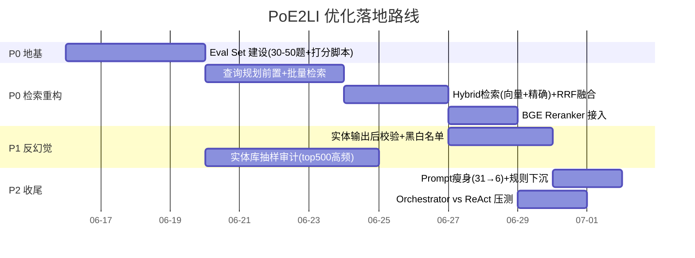

# PoE2LI Agent 问题解决思路

> 基于 `docs/agent-analysis.md` 的现状分析，给出一套**分优先级、可落地、有验证手段**的解决方案。
> 核心判断：当前所有"已修"措施都是**外挂式补丁**（去重、软上限、context 约束），治标不治本。真正的解法是**把"自由 ReAct 检索"改造成"先规划、强约束、可验证"的受控流水线**。

---

## 0. 一句话诊断

> **根本矛盾不是 LLM 不听话，而是架构把"决定搜什么/搜几次/信什么"这些高风险决策，全部交给了一个无状态、无地图、无验证的 LLM 自由发挥。**

四个表面问题（调用失控、幻觉、检索精度、prompt 臃肿）其实是**同一个病根**的四种症状：**缺少一个权威的、结构化的中间层把 LLM 决策约束在轨道上**。所以解决方案的主线是：**把约束从"prompt 里的文字祈求"下沉到"代码层的硬性 enforce"**。

---

## 1. 优先级总览

| 优先级 | 方向 | 解决的核心问题 | 预期收益 | 工程量 |
|--------|------|----------------|----------|--------|
| **P0** | 建立 Eval Set（评测体系） | 缺少评测 → 所有改进靠肉眼 | 解锁一切后续优化的"标尺" | 中 |
| **P0** | 检索流水线重构（规划→单次混合检索→rerank） | 调用失控 + 检索精度 | 响应 76-87s → 目标 <15s | 中-高 |
| **P1** | 实体 Grounding 硬约束（代码层 enforce） | 幻觉 / 实体编造 | 幻觉率显著下降 | 中 |
| **P1** | 实体库质量审计 + 来源分级 | 实体库质量未知 | 给 grounding 提供可信底座 | 中 |
| **P2** | System Prompt 瘦身（31→6 条 + 分层） | prompt 臃肿 | 规则遵守率提升 | 低 |
| **P2** | Orchestrator vs ReAct A/B 压测 | 两模式无数据 | 用数据做架构决策 | 低-中 |

> **关键顺序**：先做 Eval Set（P0），否则后面每一步都不知道"改好了还是改坏了"。这是整个项目从"凭感觉调"升级到"凭数据调"的分水岭。

---

## 2. P0-A：先建评测体系（一切的前提）

### 为什么排第一
分析文档里写"所有改进靠肉眼判断"——这是最危险的状态。没有标尺，你永远不知道一个改动是真的修好了，还是只是换了个 bug。**先花 2-3 天建 eval set，后面每个优化的 ROI 都能翻倍。**

### 怎么做（轻量版，别上来就 RAGAS）
1. **收集 30-50 个典型问题**，覆盖三类高频场景：
   - 配 BD 类（"召唤女巫开荒 BD"）—— 测调用次数 & 延迟
   - 百科问答类（"扭曲项链是什么"）—— 测实体准确性 & 防泛类目
   - PoB 解析类（贴 PoB code 求攻略）—— 测解析正确性
2. **每个问题标注**：
   - `expected_entities`：答案里**必须出现**的正确实体（白名单）
   - `forbidden_entities`：**绝不能出现**的实体（如 PoE1 技能名 Unearth、Minion Mastery）—— 这条直接量化幻觉
   - `max_tool_calls`：期望的工具调用上限
3. **自动化打分脚本**（不依赖 LLM judge，先用规则）：
   - 幻觉率 = 命中 forbidden_entities 的回答数 / 总数
   - 实体召回 = 命中 expected_entities 的比例
   - 平均工具调用次数、P50/P95 延迟
4. **接入 Langfuse**（项目已有 `llm_client.py` 统一出口 + Langfuse 追踪）：每次回归跑一遍，结果落 trace，趋势可视化。

### 验收标准
> 能用一条命令跑出"幻觉率 X%、实体召回 Y%、平均调用 N 次、P95 延迟 Ts"四个数字，并且能跨版本对比。

---

## 3. P0-B：检索流水线重构（治"调用失控"的根）

### 现状的病
ReAct 循环里，LLM 自己决定"再搜一次试试"，用不同 rewording 搜 5-6 次（"witch summon leveling" → "infernalist ascendancy" → "skeletal warrior skills"）。Jaccard 去重只能拦**字面近似**的 query，拦不住**语义相关但措辞不同**的多次搜索。

### 核心思路：把"边想边搜"改成"先想清楚，一次搜全"

```
现状（失控）：
  LLM → 搜 → 看结果 → 想"不够" → 再搜 → ... ×5-6  （每轮都有 LLM 决策开销）

目标（受控）：
  LLM 一次性规划查询计划 → 代码层执行 1 次混合检索 → rerank → 合成
```

#### 具体方案

**① 查询规划前置（Query Planning，1 次 LLM 调用）**
- 不让 LLM 在循环里临时起意，而是**先让它一次性产出结构化查询计划**：
  ```json
  {
    "intent": "build_recommendation",
    "subqueries": ["witch infernalist leveling skills", "skeleton minion support gems"],
    "entities_to_resolve": ["召唤女巫", "地狱主义者"],
    "expected_answer_type": "playbook"
  }
  ```
- subqueries **强制上限 ≤ 2-3**，在代码层截断，不靠 prompt 祈求。

**② 单次混合检索（Hybrid Retrieval）替代多次纯向量**
- 把 subqueries **批量并行**检索（而非串行多轮），一次拿回所有候选。
- **向量检索 + 精确匹配并行**：
  - 向量：现有 pgvector + BGE-M3
  - 精确：把 `structured_entity_lookup`（ILIKE 精确查找）**主动并入主流程**，而不是只在 entity chip 时触发。这直接解决"Rattling Sceptre 在 kb_entities 有精确记录但向量排靠后"的问题。
- 用 **RRF（Reciprocal Rank Fusion）** 融合两路结果，简单、无需训练、立竿见影。

**③ 加 Reranker（降噪关键一步）**
- 候选扩大到 top-30，用 **BGE-reranker** 重排后只取 top-6-8 喂给合成层。
- 担心延迟？BGE-reranker-base 对 30 条打分 ~100-200ms，比"多搜 4 次 × 2s = 8s"划算太多。
- **关键收益**：reranker 能把 pob source 的 PoE1 噪音 chunk 排下去（结合下面 P1 的来源加权）。

**④ concept_links 扩展改为"可选 + 受控"**
- 现状"搜 witch build 被扩展到 dog/minion"是因为概念图盲目扩展。
- 改为：只在**精确实体未命中**时才触发 concept_links，且扩展结果单独走 rerank，不污染主路。

### 预期效果
- 工具调用从 5-6 次 → **1 次规划 + 1 次批量检索**
- 响应 76-87s → **目标 <15s**（省掉 4 次串行 LLM 决策往返 + 4 次串行检索）
- 检索精度靠 reranker + 精确匹配层提升

---

## 4. P1-A：实体 Grounding 硬约束（治"幻觉"的根）

### 现状的病
`_collect_entity_facts()` 已经在做"检索后提取实体 → 查 kb_entities → 注入 prompt 顶部 + 约束 LLM 只引用列出的实体"。但分析文档自己点破了死穴：
> **约束只存在于 context 文本中，没有在代码层 enforce —— LLM 仍然可以忽略约束。**

这就是"用文字祈求 LLM 别幻觉"，注定不可靠。

### 核心思路：从"prompt 约束"升级到"代码层校验拦截"

**① 输出后校验（Post-hoc Entity Validation）——最高 ROI**
- 合成回答后，**用代码扫一遍**回答里提到的所有游戏实体名（技能、物品、天赋）。
- 对照"本轮注入的权威实体白名单 + kb_entities 全表"做匹配：
  - 命中白名单 → 通过
  - 不在 kb_entities 里 / 命中已知 PoE1 黑名单（Unearth、Minion Mastery 等）→ **标记为可疑**
- 处理策略（两档）：
  - **严格档**：可疑实体直接触发一次"自我修正"重生成，prompt 里明确"以下实体未经验证，请移除或替换：[...]"
  - **轻量档**：可疑实体在前端标灰 + 加"⚠️ 未验证"提示，把判断权交还用户（成本最低，体验诚实）

**② 建 PoE1/PoE2 实体黑白名单**
- 把已知的 PoE1-only 实体（Unearth、Minion Mastery、畸变 vs 扭曲项链这类历史踩坑）沉淀成**结构化黑名单表**，而不是塞进那 31 条 prompt 规则里。
- 校验层直接查表，命中即拦。这同时给 P2 的 prompt 瘦身腾了空间。

**③ 注入实体来源分级（配合 P1-B）**
- `_collect_entity_facts()` 注入时，**按 source 排序并标注**：poe2db/poe2wiki 官方实体在前并标"权威"，pob 用户构建数据在后并标"参考"。
- 合成 prompt 明确："优先采信标'权威'的实体，'参考'类仅供上下文，不得作为事实陈述。"

### 验收
> 用 P0 eval set 里的 `forbidden_entities` 指标，量化幻觉率从 baseline 下降了多少。这是把"我觉得幻觉少了"变成"幻觉率从 18% 降到 4%"。

---

## 5. P1-B：实体库质量审计 + 来源分级

### 现状的病
kb_entities 有 4,439 个实体，但**来自爬虫自动灌库、无人工审核**，"哪些是 PoE2、哪些中文名正确"依赖链路不清楚。Grounding 的可信度完全取决于这张表的质量——**地基不牢，上面盖再多约束都白搭**。

### 怎么做（抽样审计，别全量）
1. **按 type 分层抽样**：item / skill / ascendancy 各抽 50-100 个，人工或半自动核对：
   - 是否 PoE2 实体（vs PoE1 残留）
   - 中文名是否正确
   - source 标注是否准确
2. **给每个实体打 `confidence` / `verified` 标记**，落库。Grounding 优先用 verified=true 的实体。
3. **覆盖率评估**：拿真实玩家高频搜索词（可从日志/eval set 提取）对比 kb_entities，算"高频实体覆盖率"——知道盲区在哪。
4. **建增量审核流程**：新爬虫灌库时强制带 source + 灌库时间，定期抽审，避免再次"league/version 元数据丢失"那种事故。

### 关键洞察
> 不必追求 4,439 个全审。**按"被检索频率"加权审计**——top 500 高频实体审干净，就能覆盖 80%+ 的真实问答。这是典型的二八法则应用。

---

## 6. P2-A：System Prompt 瘦身 + 分层

### 现状的病
AGENT_SYSTEM 有 31 条规则（~2000 tokens），每次调用都全量塞。**规则越多，单条遵守概率越低**（注意力稀释），这是 LLM 的已知特性。而且很多规则是单点经验（"扭曲 vs 畸变项链"），不该占用全局 prompt 预算。

### 核心思路：核心原则进 prompt，单点规则进代码/数据层

**① 把 31 条拆成三类，分别安置**

| 类别 | 例子 | 新归属 |
|------|------|--------|
| 核心行为原则（5-8 条） | "只引用权威实体""一次规划不要多轮搜索" | 留在 AGENT_SYSTEM |
| 实体级特例（扭曲/畸变项链） | 具体实体名纠错 | 下沉到**实体黑白名单表**（P1-A），校验层 enforce |
| 场景级规则（百科问题不返回泛类目） | 特定 intent 的处理 | 下沉到**对应 skill / intent handler** 的局部 prompt |

**② 核心 6 条原则示范**（精炼到肌肉记忆级别）：
1. 先规划再检索，单轮不重复搜同一主题
2. 只陈述出现在「权威实体列表」中的实体属性
3. 不确定就说不确定，禁止编造实体/数值
4. 百科类问题给精确答案，不返回泛类目搜索结果
5. PoB 数值直接采信 PoB，绝不重算
6. 答案用中文，结构化输出攻略

**③ 收益**：prompt token 减半 + 每条规则注意力权重翻倍 + 单点规则由代码 enforce（比 LLM 自觉更可靠）。

---

## 7. P2-B：Orchestrator vs ReAct A/B 压测

### 现状的病
默认跑 legacy ReAct，orchestrator（Planner→并行 dispatch→synthesis）设计好了但没充分用，**两种模式无 A/B 数据**，纯靠直觉选。

### 怎么做（有了 P0 eval set 就很简单）
- 用同一份 eval set，分别跑 legacy 和 orchestrator，对比三个核心指标：**幻觉率 / P95 延迟 / 平均工具调用次数**。
- 注意：本方案 P0-B 的"查询规划前置"其实就是 orchestrator 思路的轻量版。**很可能压测结论是 orchestrator 在延迟和可控性上胜出**——但要用数据说话，别拍脑袋。
- 输出一张对比表，作为"默认走哪个模式"的决策依据。

---

## 8. 落地路线图（建议 4 周节奏）



### 里程碑
- **第 1 周末**：eval set 跑通，拿到 baseline 四指标（幻觉率/召回/调用数/延迟）
- **第 2 周末**：检索流水线重构完成，延迟 76s→<15s，调用 5次→2次
- **第 3 周末**：反幻觉硬约束上线，幻觉率指标明显下降
- **第 4 周末**：prompt 瘦身 + 压测报告，输出"默认模式"决策

---

## 9. 几个反直觉但重要的判断

1. **别先冲 reranker / RAGAS 这些"高级武器"** —— 先建 eval set。没有标尺，高级武器只会让你更快地往错误方向跑。
2. **去重和软上限是治标** —— 它们拦的是"重复搜索"的**结果**，没解决"为什么 LLM 想多次搜索"的**原因**。原因是 ReAct 让它边想边搜。改成先规划，问题自然消失。
3. **反幻觉的关键不在 prompt，在代码层校验** —— "约束只活在 context 文本里"是当前最大的认知误区。LLM 的输出必须被代码兜底校验，就像不能让用户输入不经后端校验直接入库。
4. **实体库审计要按频率加权** —— 4439 个全审是工程灾难，top 500 高频审干净就覆盖大部分场景。
5. **Orchestrator 很可能是对的，但要用数据证明** —— P0-B 的规划前置本质就是 orchestrator 的轻量化，压测大概率会验证这个方向。

---

## 10. 风险与权衡

| 改动 | 风险 | 缓解 |
|------|------|------|
| 查询规划前置 | Planner 本身也是 LLM，也会规划错 | 规划失败时降级回单次 ReAct，eval set 监控 |
| 加 Reranker | 增加 ~150ms 延迟 | 相比省掉的 4 次串行检索（8s），净赚 |
| 输出后校验+重生成 | 严格档可能增加一次 LLM 调用 | 默认走轻量档（前端标灰），严格档仅高风险 intent 开启 |
| Prompt 瘦身 | 删规则可能丢失历史踩坑经验 | 规则不是删除，是**下沉到代码/数据层 enforce**，反而更可靠 |
| 实体库审计 | 人工成本 | 按频率加权 + 半自动（用官方 poe2db 做交叉验证） |

---

> **总结**：这套方案的灵魂是一句话——**把交给 LLM 自由发挥的高风险决策（搜几次、信什么、说什么），逐层下沉为代码可 enforce、可验证的受控流程**。Eval Set 是标尺，检索重构治调用失控，实体硬校验治幻觉，prompt 瘦身释放注意力。四者环环相扣，且每一步都能用 P0 的指标量化验证。

---

# 附录 A：三个核心工程难点的落地细节

> 正文给了"做什么（what）"，本附录补"具体怎么做（how）"。这三处是评审时最容易被追问、也最能决定方案能否真正落地的深水区。
> **贯穿三者的同一思想**：能用确定性的数据结构/集合运算解决的，就别用 LLM；LLM 只留给真正需要语义判断的最后一小撮兜底。

---

## A.1 输出后校验：实体名到底怎么扫？（正则 vs LLM-NER 的第三条路）

> ⚠️ **重要前置提示**：本节给出的 Aho-Corasick 方案仅适用于**英文实体名**。**中文实体名因无天然词边界，请直接以附录 B.2 的 jieba 自定义词典方案为准**，不要照搬本节 AC 代码处理中文。

### 问题重述
正文说"用代码扫一遍回答里的实体名"——但纯正则容易漏（规则永远写不全），调 LLM 做 NER 又加延迟加成本。这是 P1-A 的核心工程难点。

### 关键认知转换：这不是 NER 问题，是字典匹配问题
你已经有一张 4439 实体的 kb_entities 表。所以要解决的**不是**"从自由文本里发现未知实体"（开放域 NER），而是"**回答里提到的实体，在不在我的已知词典里**"。问题性质一变，方案豁然开朗——用 **Aho-Corasick 多模式匹配**。

### 推荐方案：Aho-Corasick 自动机（零 LLM、~1ms）

```python
import ahocorasick

# 一次性构建（服务启动时），用 kb_entities 全表实体名 + 别名建 AC 自动机
def build_entity_automaton(kb_entities):
    A = ahocorasick.Automaton()
    for ent in kb_entities:
        for name in [ent.name_en, ent.name_zh, *ent.aliases]:
            if name:
                A.add_word(name.lower(), (ent.id, name, ent.verified, ent.is_poe1))
    A.make_automaton()
    return A

# 每次校验（运行时，纯 CPU，~1-2ms，零 LLM 调用）
def validate_answer(answer_text, automaton, whitelist_ids):
    suspicious = []
    for _end_idx, (ent_id, name, verified, is_poe1) in automaton.iter(answer_text.lower()):
        if is_poe1:                         # 命中 PoE1 黑名单 → 高危
            suspicious.append((name, "PoE1_RESIDUE"))
        elif ent_id not in whitelist_ids:   # 不在本轮注入的权威白名单 → 中危
            suspicious.append((name, "NOT_GROUNDED"))
    return suspicious
```

**为什么这套是对的：**
- AC 自动机一次扫描 O(文本长度)，4439 个模式同时匹配，~1-2ms，**零 LLM 成本、零额外延迟**。
- 精确解决"正则漏"——AC 是字典全匹配，只要实体名在词典里就一定扫到，不存在正则"规则写不全"的问题。
- 它扫不到的（词典外的生造词）恰恰不是主要威胁：PoE 玩家关心的幻觉是"把真实存在的 PoE1 技能/不存在的搭配说成 PoE2 的"，这些名字**都在实体宇宙里**，AC 必然命中。

### 唯一盲区（纯生造词）的两档兜底
- **轻量兜底（默认）**：不管它。生造词在攻略场景极少，玩家一搜即知，体验损失可控。
- **重兜底（仅高风险 intent，如"推荐核心装备"）**：用正则粗筛大写专有名词 `[A-Z][a-z]+(?: [A-Z][a-z]+)*` → 缩小到 3-5 个"疑似实体但未命中词典"的候选 → **一次性**批量丢给 LLM 判断"是不是编的"。注意是先正则缩小候选再一次 LLM 批判，**不是全文 NER**，延迟从几秒降到几百 ms。

> **一句话**：90% 的幻觉用 AC 自动机零成本拦掉，剩下 10% 生造词用"正则粗筛 + 一次 LLM 批判"兜底。

---

## A.2 查询规划失败时，到底怎么降级？（绝不能退回失控循环）

### 问题重述
正文说"降级回单次 ReAct"——但若退回老的循环逻辑，等于没降级，病根（边想边搜 5-6 次）还在。真正的降级必须**有损但受控**。

### 先区分两种"规划失败"

**情况 A：Planner 输出了，但格式坏了（JSON 解析失败 / subqueries 为空）**
→ 降级到**单次裸检索**：直接拿用户原始 query 做一次混合检索（向量+精确），top-k 喂合成层，**搜一次就停，不进任何循环**。
理由：用户原话本身就是合法 query，规划只是优化它，规划挂了不代表不能搜。有损（少了实体改写）但绝对受控。

**情况 B：Planner 报错/超时（LLM 调用本身失败）**
→ 降级到**模板化规划**（规则替 LLM）：
```
原始 query → 关键词抽取(jieba/已有分词) →
  命中 kb_entities 实体名 → 走精确检索
  否则               → 走向量检索
单次执行，不循环
```
相当于退回"传统搜索引擎"模式，慢但稳。

### 关键设计：硬预算闸门永远兜底
无论哪档降级，都被全局硬约束罩住：`MAX_TOTAL_RETRIEVALS = 2`，**代码层强制计数器**。这是与老 ReAct 的本质区别——老 ReAct 是"LLM 想搜几次搜几次 + 软提醒"，新架构是"**代码层铁闸，第 3 次检索物理上发不出去**"。

```python
class RetrievalBudget:
    def __init__(self, max_calls=2):
        self.remaining = max_calls
    def spend(self):
        if self.remaining <= 0:
            raise BudgetExhausted   # 物理拦截，不是 prompt 祈求
        self.remaining -= 1
```

> **"降级"的正确含义不是"回到循环"，而是"换一个更笨但更可控的单次检索策略，且永远被硬预算闸门罩住"**。失控循环这个选项，在新架构里根本不存在了。

---

## A.3 forbidden_entities 黑名单怎么维护？（不靠踩坑，靠集合差集）

### 问题重述
PoE1/PoE2 没有官方黑名单清单。靠踩坑积累是最差方案——被动、滞后、永远补不全。

### 核心思路：黑名单 = PoE1 实体集 − PoE2 实体集（自动求差集）
不需要人肉列举 PoE1 残留，只需三步：
1. 拿一份 **PoE1 实体全集**（技能/物品/天赋名）
2. 拿你的 **PoE2 实体全集**（即 kb_entities）
3. **差集** = 在 PoE1 有、PoE2 没有的实体 = 自动生成的 forbidden 候选

### PoE1 实体全集从哪来（这是可得的）
PoE1 数据源非常成熟：**poedb.tw（PoE1 版）、官方 PoE1 Wiki、RePoE 开源数据包（GitHub）**，都能整表爬/下载，拿到几千个 PoE1 技能+物品名，一次性灌进 `poe1_entities` 表。

```python
poe1 = load_poe1_entities()                # 来自 RePoE / poedb PoE1
poe2 = {e.name_en for e in kb_entities}     # 你的现有库

# 在 PoE1 有、PoE2 没有 → 高度疑似"穿越实体"
# 差集已天然排除"两代同名且都合法"的（如 Fireball），无需额外处理
forbidden_candidates = poe1 - poe2
```

### 补强：易混词对表（差集抓不到的那 10%）
像"扭曲项链 vs 畸变项链"——不是 PoE1/PoE2 差异，而是**中文译名/近义词混淆**，差集抓不到。单独维护一张小的 `confusable_pairs` 表（几十条量级即可），并且：
- **从 eval set 的 badcase 半自动沉淀**：每次 eval 跑出一个幻觉，就把"错误实体→正确实体"自动追加进这张表。
- 这才是"踩坑积累"该用的地方——**只补差集抓不到的近义混淆，不是维护整个黑名单**。

> **一句话**：90% 的 forbidden_entities 用 `PoE1全集 − PoE2全集` 一行集合运算自动生成；剩下 10% 译名混淆用一张几十条的易混词对表 + eval badcase 自动回流。踩坑只补边角，不是主力。

---

## A.4 三个难点的共同范式

| 难点 | 错误做法（直觉） | 正确做法（确定性优先） | LLM 只用在哪 |
|------|------------------|------------------------|--------------|
| 实体校验 | 全文 LLM-NER / 写不全的正则 | AC 自动机字典匹配（~1ms） | 仅生造词粗筛后一次批判 |
| 规划降级 | 退回失控 ReAct 循环 | 单次裸检索/模板规划 + 硬预算闸门 | 不用 |
| 黑名单维护 | 人肉踩坑积累 | PoE1−PoE2 集合差集自动生成 | 仅 badcase 回流易混词对 |

> 三者共享同一条主线，与正文完全一致——**把高风险决策从 LLM 手里拿回来，下沉到代码层用确定性手段 enforce**。LLM 退守为"最后一小撮语义兜底"，而非流程主干。

---

# 附录 B：两个二阶工程暗礁

> 附录 A 解决了"how"，但 how 里又藏着更深的坑。这两处是真正动手写代码时才会撞到的二阶问题，提前点破能省下一轮返工。

---

## B.1 RRF 融合：精确匹配与向量检索该"平等融合"还是"分层"？

### 先厘清一个被混淆的前提
"精确命中要不要置顶"这个问题，背后是个架构选择：**精确匹配和向量检索，是"两个平等召回源"还是"一个权威源 + 一个补充源"？**
判断：**对 PoE 场景，它俩不平等，该分层而非平等融合。**

### 为什么"无脑标准 RRF"在这里是错的
标准 RRF 公式：
```
RRF_score(d) = Σ_i  1 / (k + rank_i(d))      # k 常数，通常 60
```
RRF 的设计前提是**各路召回质量相当、只是侧重不同**（如 BM25 vs dense）。但在 PoE 场景：
- 精确命中（ILIKE 命中 kb_entities）= **确定性、100% 正确的实体定位**
- 向量 top-1 = **概率性、可能跑偏的语义相似**

若平等融合，假设两者都排 rank=1：
```
两者 RRF 贡献都是 1/(60+1) = 0.0164   ← 精确命中的确定性优势被抹平
```
这就是"精确命中应该置顶"直觉的来源。

### 推荐方案：分层 RRF（Tiered Fusion）

```python
def tiered_fusion(exact_hits, vector_hits, k=60,
                  EXACT_WEIGHT=2.0, VECTOR_WEIGHT=1.0):
    scores = {}
    # 第一层：精确命中享受权威加成
    for rank, doc in enumerate(exact_hits, start=1):
        scores[doc.id] = scores.get(doc.id, 0) + EXACT_WEIGHT / (k + rank)
    # 第二层：向量结果正常 RRF
    for rank, doc in enumerate(vector_hits, start=1):
        scores[doc.id] = scores.get(doc.id, 0) + VECTOR_WEIGHT / (k + rank)
    return sorted(scores.items(), key=lambda x: -x[1])
```

权重三档策略，对应三种产品哲学：

| 策略 | 配比 | 行为 | 适用 intent |
|------|------|------|-------------|
| 硬置顶 | 精确命中绕过 RRF 直接占 top-N | 精确命中永远最前，向量填剩余位 | 百科精确问答（"扭曲项链是什么"） |
| 强加权 | `EXACT=2.0, VECTOR=1.0` | 精确分数翻倍，强向量信号仍可挤入 | 配 BD（"召唤女巫 BD"） |
| 平等 | 都 = 1.0（退化标准 RRF） | 两路平等 | 模糊探索，无实体锚点 |

### 核心建议：按 intent 动态选策略，而非全局常量
```python
FUSION_STRATEGY = {
    "encyclopedia": "hard_pin",     # 百科 → 硬置顶
    "build_rec":    "strong_boost", # 配BD → 强加权
    "explore":      "equal_rrf",    # 探索 → 平等
}
```
> **架构红利**：P0-B 的"查询规划前置"产出的 `intent`，不仅控制检索次数，还驱动下游融合策略——**一个规划动作价值复用两次**。

### 必避暗坑：去重时机
精确命中的 chunk 和向量召回的 chunk 可能指向**同一篇文档**。融合**前**必须按 `doc.id` 去重，否则同一文档两路各算一次分被不公平抬高；去重时保留 rank 更靠前的那个。

---

## B.2 中文 AC 匹配：分词边界陷阱（修正 A.1 的结论）

### 戳中的真问题
英文 "Rattling Sceptre" 有空格，`\b` 词边界一卡就干净。但中文 AC 是**纯字符流匹配**，会同时产生两类错误：
- **过命中**："扭曲项链" 出现在 "扭曲项链强化" 里也报命中，但其实是另一个实体
- **错命中**：实体 "项链" 会在 "扭曲**项链**" 里命中，误以为提到了泛化的"项链"

**中文没有天然词边界，纯字符级 AC 会同时过命中和错命中。**

### 解法三层，按精度递增

**第一层：最长匹配优先（解决 "项链 vs 扭曲项链"）**
```python
def longest_match_filter(matches):  # matches: [(start, end, ent), ...]
    matches.sort(key=lambda m: (m[0], -(m[1] - m[0])))
    result, occupied = [], []
    for start, end, ent in matches:
        if any(s <= start and end <= e for s, e in occupied):
            continue  # 被更长匹配覆盖 → 丢弃
        result.append((start, end, ent)); occupied.append((start, end))
    return result
```

**第二层：边界校验（解决 "扭曲项链" vs "扭曲项链强化"）**
关键：不能"右边是中文就拒绝"（否则"扭曲项链很强"被误杀），而要看"右边的字能否和当前匹配拼成**另一个更长的已知实体**"：
```python
import re
CJK = re.compile(r'[\u4e00-\u9fff]')
def is_valid_boundary(text, start, end, automaton):
    next_char = text[end] if end < len(text) else ''
    if CJK.match(next_char):
        extended = text[start:end+1]
        return not is_prefix_of_any_entity(extended, automaton)  # 拼成更长实体才算可疑
    return True
```

**第三层（推荐，最稳）：复用 jieba 自定义词典，走词级匹配**
别在原始字符流跑 AC——降级方案本来就要用 jieba，那就把实体名加进自定义词典，让分词器保证边界：
```python
import jieba
for ent in kb_entities:
    jieba.add_word(ent.name_zh, freq=10000)   # 高频强制成词，防被切碎

def validate_answer_zh(answer_text, entity_name_set):
    tokens = jieba.lcut(answer_text)
    return [t for t in tokens if t in entity_name_set]  # O(1) set 查找
```
**为什么最优**：jieba 自定义词典天然处理边界（"扭曲项链强化"→`["扭曲项链","强化"]`，"扭曲项链很强"→`["扭曲项链","很","强"]`，干净命中且不误命中"项链"）；词级查找 O(1)；**复用项目已有 jieba 依赖，不引入新库**。

### 中英混排最终方案

| 文本类型 | 匹配方案 |
|----------|----------|
| 英文实体名（有空格边界） | AC 自动机 + `\b` 词边界 |
| 中文实体名（无边界） | jieba 自定义词典分词 + 词级 set 查找 |
| 混排 | 两套并行跑，结果合并去重 |

> **修正 A.1 的结论**：纯 AC 自动机只适合英文；中文必须走"分词器自定义词典"，靠分词器解决边界——恰好复用降级方案里的 jieba，一鱼两吃。
