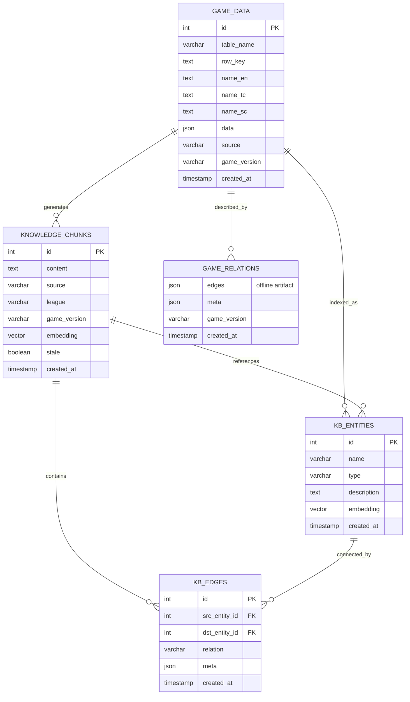

# Phase 2 数据管道架构设计

> 阶段：设计 / 探路  
> 作者：松烟（后端开发）  
> 日期：2026-06-26  
> 关联：Phase 1 MVP 已合入 main（f48a195），本文件为 Phase 2 方向设计，不直接修改生产代码。

## 执行摘要

**核心结论**：
- 知识图谱入库采用三路线并行：A. `game_relations.json` 自动化进 pipeline；B. `game_data` 关键表生成 `knowledge_chunks`；C. 统一 `GameGraph` 查询入口
- 技术栈保持 `GameGraph` 内存方案 + PostgreSQL `kb_entities/kb_edges`，Phase 2 不引入图数据库
- 实施顺序：Week 1 路线 A，Week 2-3 路线 B，Week 4 路线 C

**分工边界**：
- 守夜：GGPK 导出侧（`export_en_tc.py`、`extract_sc.py`、TC 补齐）
- 松烟：入库/知识图谱/pipeline 编排（`import_game_data.py`、`game_relations.json` 解析、`kb_entities/kb_edges` 入库）

**待决策项**：
- `game_relations.json` 是否双写 PostgreSQL？（建议先保持 JSON）
- `KbEntity` 是否需要 `game_version` 字段？（**已决策：需要**）
- 路线 B 是否依赖 TC 数据补齐？（建议不阻塞，EN fallback 启动）

**协作对齐**：
- 已与守夜对齐分工边界：守夜负责 GGPK 导出侧，松烟负责入库/知识图谱/pipeline 编排
- 守夜已产出 `docs/phase2-alignment-draft.md`，松烟已 review 无异议

**远岫评审结论**（Phase 2 架构 review）：
- 整体 approve
- 路线 C（统一 `GameGraph` 查询入口）推迟到 Phase 3
- `KbEntity` 增加 `game_version` 字段，支持多版本并存
- 继续内存方案，不引入图数据库

**Benchmark 基线**（`backend/scripts/benchmarks/game_graph_latency.py`）：
- `find_entity`：p50 50~78ms，p95 56~114ms，max 56~700ms
- `expand` 2 跳：p50 0.024~0.507ms
- 瓶颈定位：`find_entity` 词匹配循环，不在 BFS
- Neo4j 迁移阈值建议：`find_entity` 平均 >200ms 或 `expand` 平均 >10ms 或内存 >2GB 或边数 >2M

---

## 1. 知识图谱入库方向

### 1.1 现状

当前知识图谱相关能力分布在两个层面：

| 层面 | 组件 | 现状 |
|------|------|------|
| **文件层图查询** | `backend/scripts/game_graph.py` | 读取 `game_relations.json`，提供 BFS 遍历、实体查找；纯内存计算，无持久化 |
| **数据库层图** | `backend/app/models/knowledge_graph.py` + `backfill_knowledge_graph.py` | 已有 `kb_entities` / `kb_edges` 表，可从 `knowledge_chunks` 回填实体和边，但**不是 game_data 的入库步骤** |

### 1.2 问题

1. **game_data 与 knowledge_chunks 是两条独立管线**：前者来自 GGPK 导出，后者来自 RAG/爬虫/作业本，没有自动关联。
2. **`game_relations.json` 是离线产物**：每次 GGPK 更新需手动跑 `resolve_relations.py`，不随 `import_game_data.py` 自动触发。
3. **知识图谱查询入口不一致**：Agent 工具可能调用 `GameGraph`（文件层）或 `knowledge_graph_service`（DB 层），存在语义差。

### 1.3 Phase 2 方向

**目标**：让知识图谱成为数据管道的可重复步骤，而不是一次性离线产物。

**三条并行演进路线**：

| 路线 | 描述 | 优先级 |
|------|------|--------|
| **A. game_relations 自动化** | `run_pipeline.py` 新增 `relations` step，GGPK 更新后自动重新解析 FK 并写入 DB 或更新 JSON | P0 |
| **B. game_data → knowledge_chunks 桥接** | 在 `import_game_data.py` 导入完成后，自动为关键表（Mods/Stats/PassiveSkills 等）生成知识片段并写入 `knowledge_chunks` | P1 |
| **C. 统一图查询入口** | 将 `GameGraph` 的内存图与 `kb_entities/kb_edges` 的 DB 图合并为单一 `GameDataGraph` 服务，供 Agent 和 API 共用 | P1 |

### 1.4 推荐实施顺序

```
Phase 2 Week 1: 路线 A
  - run_pipeline.py 已有 relations step
  - 增加版本检查：对比新旧 game_relations.json 的 hash/timestamp
  - 可选：将 edges 写入 PostgreSQL 的 kb_edges 表，替代纯 JSON 文件

Phase 2 Week 2-3: 路线 B
  - 新增 scripts/backfill_game_data_chunks.py
  - 读取 game_data 中关键表，按 locale 切分知识片段
  - 调用 embedding_service 写入 knowledge_chunks

Phase 2 Week 4: 路线 C
  - 新增 backend/app/services/game_data_graph.py
  - 优先加载 DB 中的 kb_entities/kb_edges
  - 降级到 game_relations.json 文件
  - 统一 API：find_entity / expand / trace
```

---

## 2. ER 图

### 2.1 核心实体关系



### 2.2 关系说明

| 关系 | 方向 | 说明 |
|------|------|------|
| GAME_DATA → KNOWLEDGE_CHUNKS | 1:N | 一行 game_data 可生成多个知识片段（按字段/段落切分） |
| GAME_DATA → KB_ENTITIES | 1:N | 一行 game_data 可索引出多个实体（如 Mod 行可能关联 Stat、Tag） |
| GAME_DATA → GAME_RELATIONS | N:1 | 所有 game_data 共享一份 `game_relations.json`，按 `table_name + row_key` 关联 |
| KNOWLEDGE_CHUNKS → KB_ENTITIES | N:N | 一个 chunk 可能提到多个实体，一个实体可能出现在多个 chunk |
| KB_ENTITIES → KB_EDGES | 1:N | 实体间的语义/统计关系 |

### 2.3 与现有模型的兼容性

- `GameDatum` 已有 `id / table_name / row_key / name_* / data / source / game_version`
- `KnowledgeChunk` 已有 `id / content / source / league / game_version / embedding / stale`
- `KbEntity` / `KbEdge` 已有基础字段，需确认是否支持 `game_version` 过滤

**待确认**：`KbEntity` 是否需要 `game_version` 字段以支持多版本并存。

---

## 3. 脚本流程编排

### 3.1 Phase 1 已有流程

```
run_pipeline.py
├── validate   → import_game_data.py --validate
├── import     → import_game_data.py --game-version X
└── relations  → resolve_relations.py → game_relations.json
```

### 3.2 Phase 2 扩展流程

```
run_pipeline.py
├── validate           → import_game_data.py --validate
├── import             → import_game_data.py --game-version X
├── relations          → resolve_relations.py → game_relations.json
├── graph-import       → game_relations.json → kb_edges/kb_entities (DB)
├── chunks-generate    → game_data → knowledge_chunks (embedding)
├── chunks-verify      → knowledge_chunks 完整性校验
└── report             → 汇总各步骤结果
```

### 3.3 新增 step 定义

| Step | 命令 | 依赖 | 输出 |
|------|------|------|------|
| `graph-import` | `scripts/backfill_game_data_relations.py --data-dir <dir>` | relations step 完成 | `kb_edges` / `kb_entities` 表更新 |
| `chunks-generate` | `scripts/backfill_game_data_chunks.py --tables Mods Stats ...` | import step 完成 | `knowledge_chunks` 表新增 |
| `chunks-verify` | `scripts/verify_knowledge_chunks.py` | chunks-generate 完成 | 覆盖率/重复率报告 |
| `report` | 内置汇总 | 所有 step 完成 | Markdown/JSON 报告 |

### 3.4 调用示例

```bash
# 全量 Phase 2 pipeline
python scripts/run_pipeline.py --data-dir data/poe2_data --game-version 0.2.0

# 仅知识图谱相关
python scripts/run_pipeline.py --data-dir data/poe2_data --step relations graph-import chunks-generate chunks-verify

# 跳过已有步骤
python scripts/run_pipeline.py --data-dir data/poe2_data --skip validate import
```

---

## 4. 与现有代码的衔接

### 4.1 Phase 1 已有 CLI

`import_game_data.py` 当前支持：
- `--data-dir`：数据目录
- `--dry-run`：模拟导入
- `--tables`：指定表
- `--game-version`：版本标签
- `--validate`：完整性校验（Phase 1 新增）
- `--validate-report`：校验报告输出路径（Phase 1 新增）

### 4.2 Phase 2 建议新增 CLI

| 脚本 | 新增参数 | 说明 |
|------|---------|------|
| `import_game_data.py` | `--relations-output` | 导入完成后自动调用关系解析，输出到指定路径 |
| `run_pipeline.py` | `--step graph-import chunks-generate chunks-verify report` | 新增步骤 |
| `backfill_game_data_relations.py` | `--batch-size / --dry-run` | 控制导入批次和模拟 |
| `backfill_game_data_chunks.py` | `--tables / --locale / --embedding-model` | 控制生成范围和模型 |
| `verify_knowledge_chunks.py` | `--check-embedding / --check-duplicates` | 多维度校验 |

### 4.3 不改变的行为

- `import_game_data.py` 的 `--import` 行为不变，仍是 delete+insert
- `run_pipeline.py` 的 validate/import/relations 三个 step 行为不变
- `game_graph.py` 的 `GameGraph` 类保持文件层查询能力，新增 DB 层 fallback

---

## 5. 依赖与风险

### 5.1 外部依赖

| 依赖 | 当前状态 | 风险 |
|------|---------|------|
| 守夜 TC 数据补齐 | 进行中 | Phase 2 路线 B 依赖 TC 数据完整度；若 TC 缺失，知识片段会降级为 EN fallback |
| PyPoE 版本 | 1.0.0a0，spec version 16 | 客户端更新可能导致 spec 不兼容；需锁定 PyPoE 版本或增加兼容层 |
| embedding_service | 已有 | 大规模 chunk 生成时可能触发 rate limit；需 batch + retry |
| PostgreSQL + pgvector | 已有 | 数据量增长后需监控 embedding 查询性能 |

### 5.2 数据量预估

| 阶段 | 数据量 | 存储估算 |
|------|--------|---------|
| game_data（当前） | ~277K rows × 24 tables | ~2-4 GB（JSON 字段膨胀） |
| game_relations.json | ~549K edges | ~80-90 MB |
| kb_entities（预估） | 50K-200K | ~500 MB - 2 GB（含 embedding） |
| kb_edges（预估） | 200K-1M | ~200 MB - 1 GB |
| knowledge_chunks（Phase 2 新增） | 50K-200K | ~1-5 GB（含 embedding） |

### 5.3 风险缓解

| 风险 | 缓解措施 |
|------|---------|
| TC 数据缺失导致知识片段质量下降 | 生成时标注 `locale` 字段，前端展示时降级提示 |
| PyPoE spec 不兼容 | 增加 spec 版本检查，不匹配时中止并告警 |
| embedding 服务不可用 | chunk 生成支持 dry-run，embedding 异步补录 |
| 数据量突增导致导入超时 | `import_game_data.py` 已有 batch_size=500，可按需调优 |
| 图查询性能下降 | `GameGraph` 已有 LRU cache，DB 层可增加 pgvector 索引 |

---

## 6. 下一步行动

1. **松烟** → 将本方案发给朝露/远岫确认技术方向
2. **远岫** → 评估路线 C（统一图查询入口）的架构影响
3. **守夜** → 确认 TC 数据补齐时间线，影响路线 B 启动窗口
4. **松烟** → 确认后开始 Phase 2 Week 1 实现（`graph-import` step）

---

*本文档为设计阶段输出，不涉及生产代码修改。*
